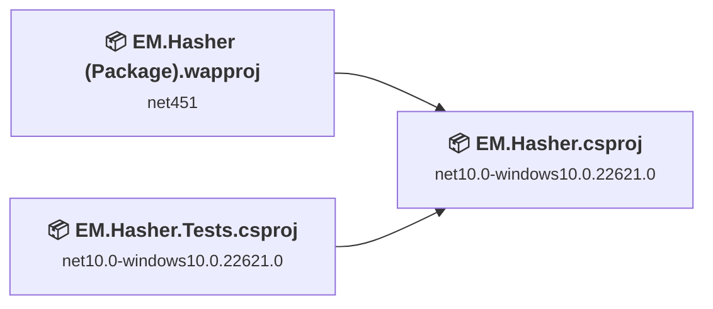
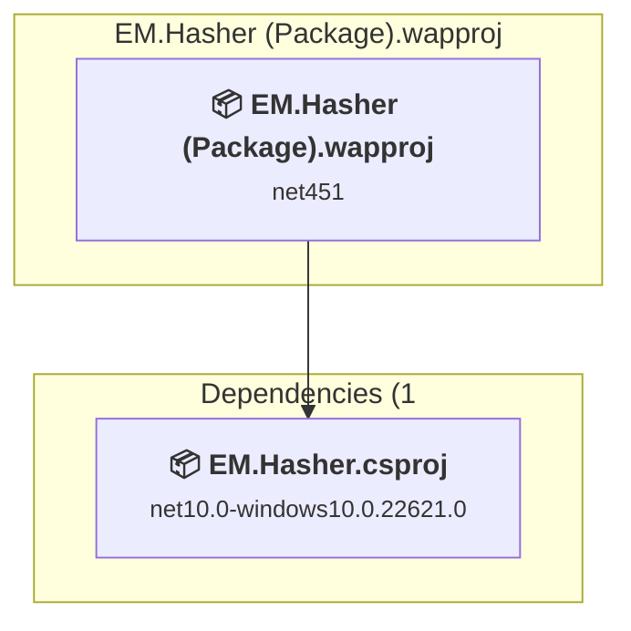
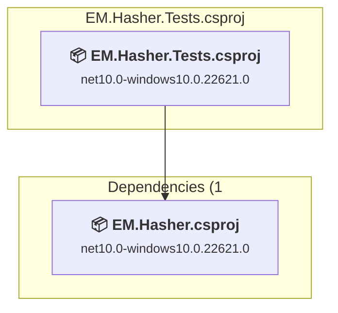
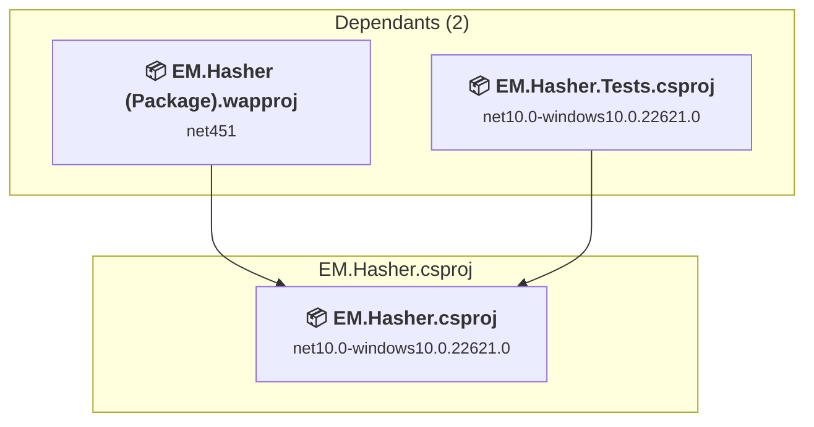

# Projects and dependencies analysis

This document provides a comprehensive overview of the projects and their dependencies in the context of upgrading to .NETCoreApp,Version=v10.0.

## Table of Contents

- [Executive Summary](#executive-Summary)
  - [Highlevel Metrics](#highlevel-metrics)
  - [Projects Compatibility](#projects-compatibility)
  - [Package Compatibility](#package-compatibility)
  - [API Compatibility](#api-compatibility)
- [Aggregate NuGet packages details](#aggregate-nuget-packages-details)
- [Top API Migration Challenges](#top-api-migration-challenges)
  - [Technologies and Features](#technologies-and-features)
  - [Most Frequent API Issues](#most-frequent-api-issues)
- [Projects Relationship Graph](#projects-relationship-graph)
- [Project Details](#project-details)

  - [EM.Hasher (Package)\EM.Hasher (Package).wapproj](#emhasher-(package)emhasher-(package)wapproj)
  - [EM.Hasher.Tests\EM.Hasher.Tests.csproj](#emhashertestsemhashertestscsproj)
  - [EM.Hasher\EM.Hasher.csproj](#emhasheremhashercsproj)

## Executive Summary

### Highlevel Metrics

| Metric | Count | Status |
| :--- | :---: | :--- |
| Total Projects | 3 | 1 require upgrade |
| Total NuGet Packages | 16 | All compatible |
| Total Code Files | 96 |  |
| Total Code Files with Incidents | 1 |  |
| Total Lines of Code | 5572 |  |
| Total Number of Issues | 1 |  |
| Estimated LOC to modify | 0+ | at least 0.0% of codebase |

### Projects Compatibility

| Project | Target Framework | Difficulty | Package Issues | API Issues | Est. LOC Impact | Description |
| :--- | :---: | :---: | :---: | :---: | :---: | :--- |
| [EM.Hasher (Package)\EM.Hasher (Package).wapproj](#emhasher-(package)emhasher-(package)wapproj) | net451 | 🟢 Low | 0 | 0 |  | WinUI, Sdk Style = True |
| [EM.Hasher.Tests\EM.Hasher.Tests.csproj](#emhashertestsemhashertestscsproj) | net10.0-windows10.0.22621.0 | ✅ None | 0 | 0 |  | WinForms, Sdk Style = True |
| [EM.Hasher\EM.Hasher.csproj](#emhasheremhashercsproj) | net10.0-windows10.0.22621.0 | ✅ None | 0 | 0 |  | WinForms, Sdk Style = True |

### Package Compatibility

| Status | Count | Percentage |
| :--- | :---: | :---: |
| ✅ Compatible | 16 | 100.0% |
| ⚠️ Incompatible | 0 | 0.0% |
| 🔄 Upgrade Recommended | 0 | 0.0% |
| ***Total NuGet Packages*** | ***16*** | ***100%*** |

### API Compatibility

| Category | Count | Impact |
| :--- | :---: | :--- |
| 🔴 Binary Incompatible | 0 | High - Require code changes |
| 🟡 Source Incompatible | 0 | Medium - Needs re-compilation and potential conflicting API error fixing |
| 🔵 Behavioral change | 0 | Low - Behavioral changes that may require testing at runtime |
| ✅ Compatible | 0 |  |
| ***Total APIs Analyzed*** | ***0*** |  |

## Aggregate NuGet packages details

| Package | Current Version | Suggested Version | Projects | Description |
| :--- | :---: | :---: | :--- | :--- |
| CommunityToolkit.Mvvm | 8.4.0 |  | [EM.Hasher.csproj](#emhasheremhashercsproj) | ✅Compatible |
| CommunityToolkit.WinUI.Controls.Primitives | 8.2.251219 |  | [EM.Hasher.csproj](#emhasheremhashercsproj) | ✅Compatible |
| CommunityToolkit.WinUI.Controls.SettingsControls | 8.2.251219 |  | [EM.Hasher.csproj](#emhasheremhashercsproj) | ✅Compatible |
| CommunityToolkit.WinUI.Converters | 8.2.251219 |  | [EM.Hasher.csproj](#emhasheremhashercsproj) | ✅Compatible |
| Crc32.NET | 1.2.0 |  | [EM.Hasher.csproj](#emhasheremhashercsproj) | ✅Compatible |
| FluentAssertions | 7.2.1 |  | [EM.Hasher.Tests.csproj](#emhashertestsemhashertestscsproj) | ✅Compatible |
| Humanizer.Core | 3.0.1 |  | [EM.Hasher.csproj](#emhasheremhashercsproj) | ✅Compatible |
| Microsoft.Extensions.DependencyInjection | 10.0.3 |  | [EM.Hasher.csproj](#emhasheremhashercsproj) | ✅Compatible |
| Microsoft.TestPlatform.TestHost | 18.0.1 |  | [EM.Hasher.Tests.csproj](#emhashertestsemhashertestscsproj) | ✅Compatible |
| Microsoft.Windows.SDK.BuildTools | 10.0.26100.7705 |  | [EM.Hasher (Package).wapproj](#emhasher-(package)emhasher-(package)wapproj) [EM.Hasher.csproj](#emhasheremhashercsproj) [EM.Hasher.Tests.csproj](#emhashertestsemhashertestscsproj) | ✅Compatible |
| Microsoft.WindowsAppSDK | 1.8.260209005 |  | [EM.Hasher (Package).wapproj](#emhasher-(package)emhasher-(package)wapproj) [EM.Hasher.csproj](#emhasheremhashercsproj) [EM.Hasher.Tests.csproj](#emhashertestsemhashertestscsproj) | ✅Compatible |
| MSTest.TestAdapter | 4.1.0 |  | [EM.Hasher.Tests.csproj](#emhashertestsemhashertestscsproj) | ✅Compatible |
| MSTest.TestFramework | 4.1.0 |  | [EM.Hasher.Tests.csproj](#emhashertestsemhashertestscsproj) | ✅Compatible |
| System.Diagnostics.EventLog | 10.0.3 |  | [EM.Hasher.csproj](#emhasheremhashercsproj) | ✅Compatible |
| System.Security.Cryptography.Pkcs | 10.0.3 |  | [EM.Hasher.csproj](#emhasheremhashercsproj) | ✅Compatible |
| WinUIEx | 2.9.0 |  | [EM.Hasher.csproj](#emhasheremhashercsproj) | ✅Compatible |

## Top API Migration Challenges

### Technologies and Features

| Technology | Issues | Percentage | Migration Path |
| :--- | :---: | :---: | :--- |

### Most Frequent API Issues

| API | Count | Percentage | Category |
| :--- | :---: | :---: | :--- |

## Projects Relationship Graph

Legend:
📦 SDK-style project
⚙️ Classic project

## Project Details

### EM.Hasher (Package)\EM.Hasher (Package).wapproj

#### Project Info

- **Current Target Framework:** net451
- **Proposed Target Framework:** net10.0-windows10.0.26100.0
- **SDK-style**: True
- **Project Kind:** WinUI
- **Dependencies**: 1
- **Dependants**: 0
- **Number of Files**: 10
- **Number of Files with Incidents**: 1
- **Lines of Code**: 0
- **Estimated LOC to modify**: 0+ (at least 0.0% of the project)

#### Dependency Graph

Legend:
📦 SDK-style project
⚙️ Classic project

### API Compatibility

| Category | Count | Impact |
| :--- | :---: | :--- |
| 🔴 Binary Incompatible | 0 | High - Require code changes |
| 🟡 Source Incompatible | 0 | Medium - Needs re-compilation and potential conflicting API error fixing |
| 🔵 Behavioral change | 0 | Low - Behavioral changes that may require testing at runtime |
| ✅ Compatible | 0 |  |
| ***Total APIs Analyzed*** | ***0*** |  |

### EM.Hasher.Tests\EM.Hasher.Tests.csproj

#### Project Info

- **Current Target Framework:** net10.0-windows10.0.22621.0✅
- **SDK-style**: True
- **Project Kind:** WinForms
- **Dependencies**: 1
- **Dependants**: 0
- **Number of Files**: 41
- **Lines of Code**: 1095
- **Estimated LOC to modify**: 0+ (at least 0.0% of the project)

#### Dependency Graph

Legend:
📦 SDK-style project
⚙️ Classic project

### API Compatibility

| Category | Count | Impact |
| :--- | :---: | :--- |
| 🔴 Binary Incompatible | 0 | High - Require code changes |
| 🟡 Source Incompatible | 0 | Medium - Needs re-compilation and potential conflicting API error fixing |
| 🔵 Behavioral change | 0 | Low - Behavioral changes that may require testing at runtime |
| ✅ Compatible | 0 |  |
| ***Total APIs Analyzed*** | ***0*** |  |

### EM.Hasher\EM.Hasher.csproj

#### Project Info

- **Current Target Framework:** net10.0-windows10.0.22621.0✅
- **SDK-style**: True
- **Project Kind:** WinForms
- **Dependencies**: 0
- **Dependants**: 2
- **Number of Files**: 82
- **Lines of Code**: 4477
- **Estimated LOC to modify**: 0+ (at least 0.0% of the project)

#### Dependency Graph

Legend:
📦 SDK-style project
⚙️ Classic project

### API Compatibility

| Category | Count | Impact |
| :--- | :---: | :--- |
| 🔴 Binary Incompatible | 0 | High - Require code changes |
| 🟡 Source Incompatible | 0 | Medium - Needs re-compilation and potential conflicting API error fixing |
| 🔵 Behavioral change | 0 | Low - Behavioral changes that may require testing at runtime |
| ✅ Compatible | 0 |  |
| ***Total APIs Analyzed*** | ***0*** |  |

