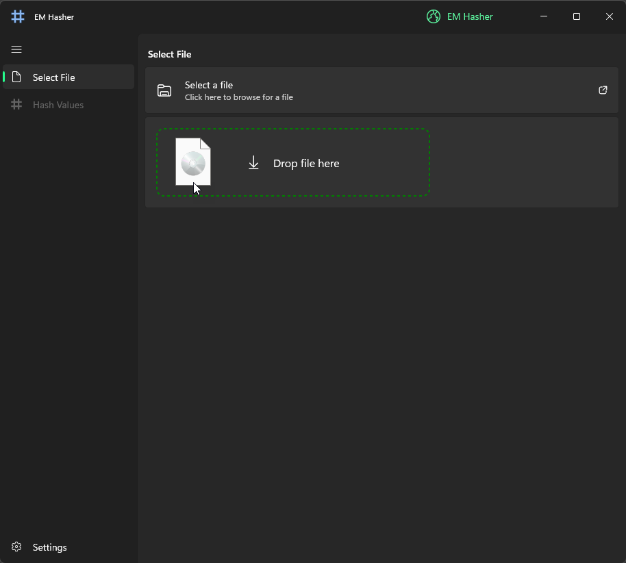
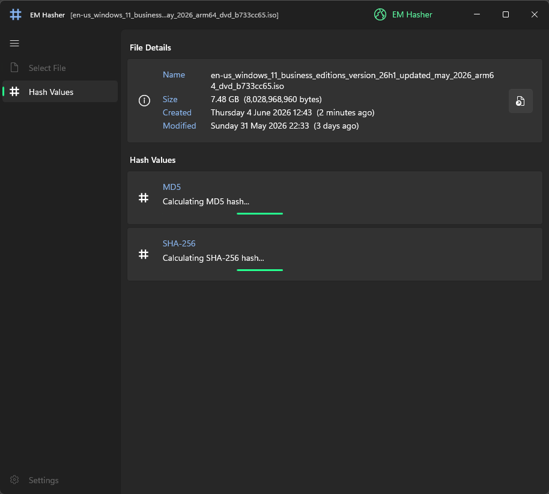
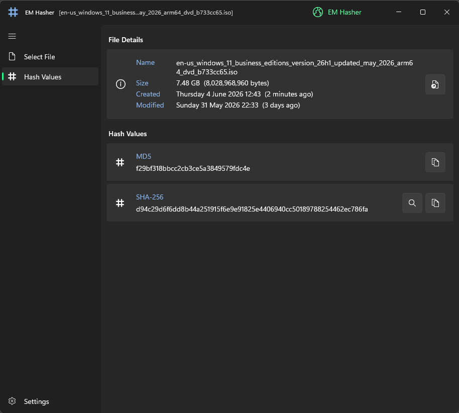
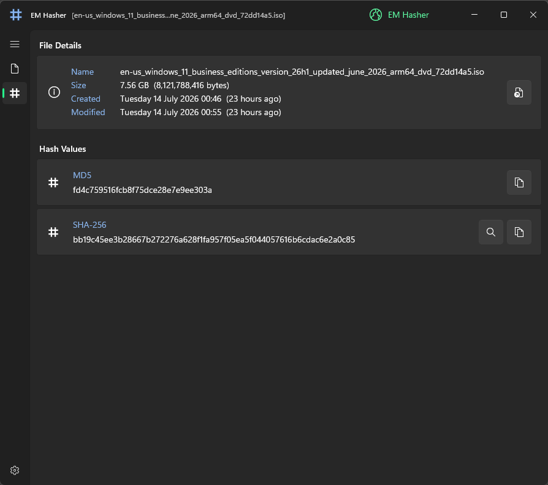
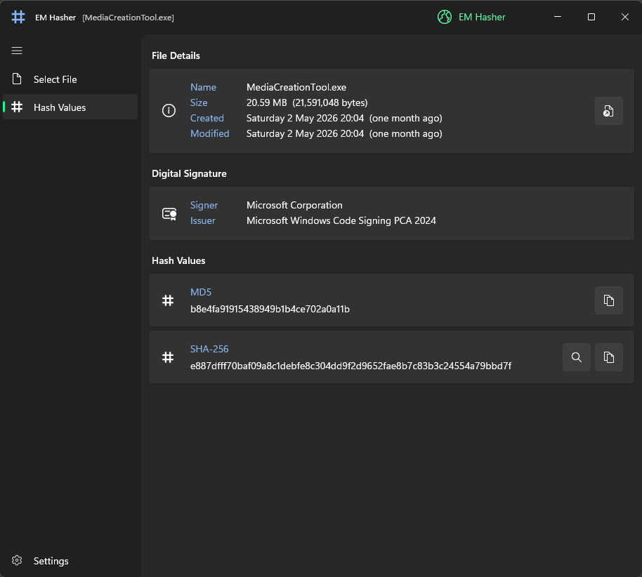
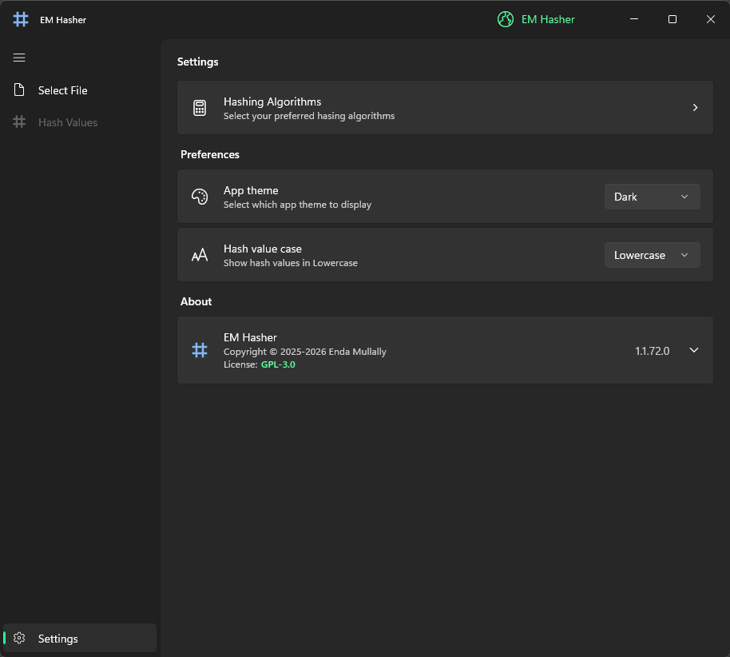
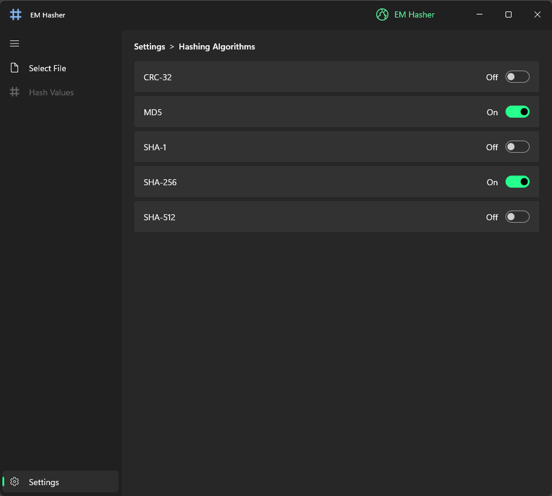
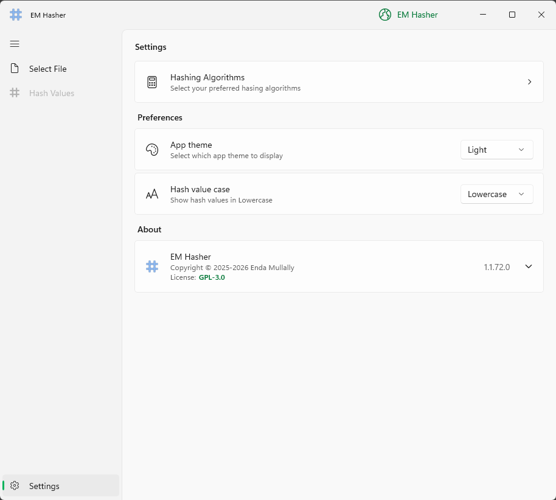

#

  

<h1 align="center">
  EM Hasher
</h1>

  Quickly calculate CRC-32/MD5/SHA-256/SHA-512 checksums in Windows 11.

 

  

## Overview

EM Hasher is a modern, simple & free hash-generating application  (WinUI 3) built from the ground up for Windows 11. Native and fast (AOT) X64|ARM64. Quickly and easily calculate file hashes directly in Windows Explorer or on your Desktop. Choose your preferred hashing algorithms, including CRC-32/MD5/SHA-256/SHA-512. What would you like to see next?

## Coming soon!

Hash verification via auto detection of file hashes contained in any local .md5, .sha256 file(s) etc. If the selected file is matched to any hash validation file, a simple validation result will be shown in the UI (icon).

 

#### Screenshots

  

  

  

  

  

  

  

  

 

## Release history

### 18/Apr/2026
v1.1.71
  - [UI] Renamed nav bar tab pages 'Select File' and 'Hash Values' and added better Icons.
  - [UI] Settings -> Hash Algorithms -> Breadcrumb style navigation (enabling new Algorithms).
  - [UI] Re-instated compact mode.

### 25/Mar/2026
v1.1.70
  - Mini release. Settings -> About. Improved copyright notice.

### 18/Mar/2026
v1.1.69
  - Misc bug fixes - Added Digital Signature info panel for signed files.

### 02/Jan/2026
v1.1.68
  - [UI] Improved look of Settings page.
  - Fixed rendering issue when app is resized on snap. App package size fixed.

### 06/Dec/2025
v1.1.67
  - [UI] Small tooltip fix.

### 03/Dec/2025
v1.1.66
  - [UI] Improved file size information - now displaying full byte size of the selected file.
  - [UI] About. Updated and added third party license links (notices).

### 24/Nov/2025
v1.1.65
  - Added a 'Search this hash on VirusTotal' button to the SHA-256 calculation tab. Note: Only the hash value itself is searched.

### 15/Nov/2025
v1.1.64
  - Upgraded packages + .NET 10 upgrade & Added 'Show file location' button to the File Information tab.

### 06/Oct/2025
v1.1.63
  - Upgraded to WinAppSDK 1.8.1 and updated UI.

### 15/Sep/2025
v1.1.62
  - Upgraded to WinAppSDK 1.8 and added improved CopyButton control (copy hash value).

### 08/Sep/2025
v1.1.59
  - Added third party license notices -> About section.

### 04/Aug/2025
v1.1.58
  - Now free & unrestricted. Enjoy :-)

### 22/Jul/2025
v1.1.57
  - UI improvements.

### 10/Jul/2025
v1.1.56
  - Added 'Copy hash to clipboard' button.

### 23/Jun/2025 ###
v1.1.55
  - Unlimited trial (with some features restricted).

### 09/Jun/2025
v1.1.54
  - Added CRC-32 hashing.

### 05/Jun/2025
v1.1.53
  - Improvements and bug fixes!

### 16/May/2025
v1.1.49
  - Added SHA-512 hashing.

### 13/May/2025
v1.1.48
  - Performance release! Managed to squeeze out a 50% perf improvement in some cases.

### 08/May/2025
v1.1.47
  - First public release. Native (AOT) compiled app, targeting X64 and ARM64.
